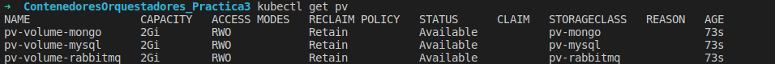

1. Creación del persistence volume --> pv-definition.yml
   ```shell
      kubectl apply -f pv-definition.yml
   ```
   **NOTA:** Es en este fichero donde se indica la ruta donde se va a guardar la información en disco en la etiqueta _hostPath_

1. Ver información sobre los volúmenes creados
   ```shell
      kubectl get pv
   ```
   

1. Creación de la reclamación del persistence volume --> pv-claim.yml
   **IMPORTANTE:** el _metadata.name_ y _storageClassName_ **DEBEN** coincidir en ambos ficheros

1. Lanzar la reclamación
   ```shell
    kubectl apply -f pv-claim.yml
   ```

1. Ver información sobre las reclamaciones de volúmenes creados
   ```shell
      kubectl get pvc
   ```
   

1. Añadir el almacenamiento en los deployments que sea necesario, en este caso en 
   * mysql.yml
   * rabbitmq.yml
   * mongodb.yml
  
   Un ejemplo sería
   ``` yml
    volumes:
        - name: mysql-storage
          persistentVolumeClaim:
            claimName: pv-volume-mysql
   ```
   **NOTA:**  claimName, debe coincidir con el nombre de establecido en pv-claim.